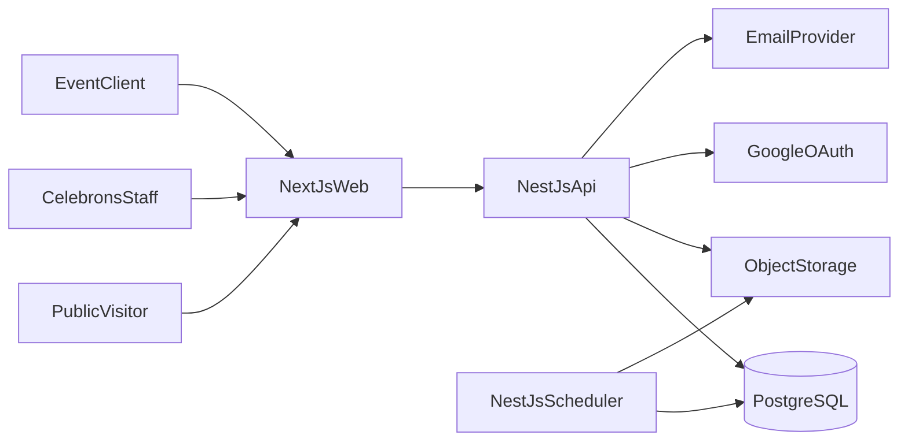
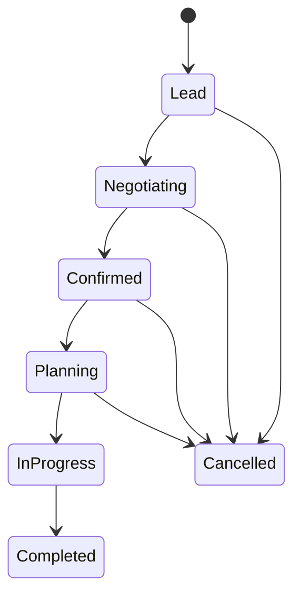
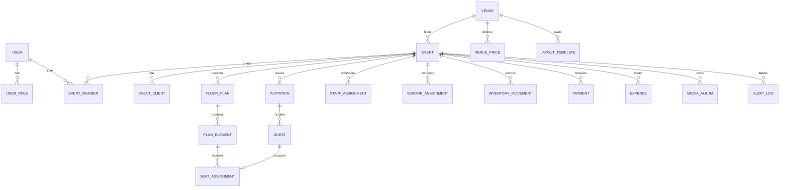
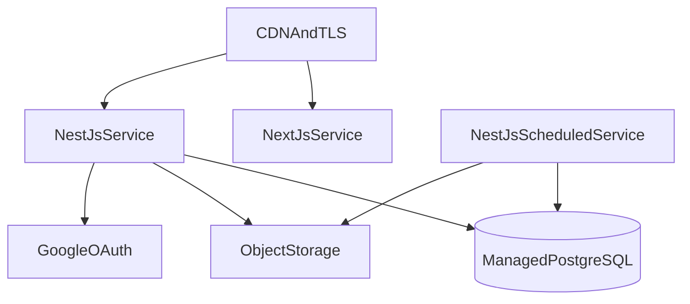

# Celebrons V2 — Architecture Plan

## 1. Purpose

Celebrons V2 is a single-organization event-management platform for Celebrons. It combines:

- a public marketing website;
- an internal operations application for Celebrons staff;
- a secure portal for event clients.

The platform covers the complete event lifecycle: inquiry, negotiation, planning, invitations, seating, logistics, personnel, vendors, payments, expenses, event-day operations, media, and reporting.

## 2. Architecture principles

1. **One event workspace:** every operational record is connected to an event.
2. **Historical accuracy:** prices, layouts, payments, stock movements, and assignments are versioned or recorded as immutable transactions.
3. **Least-privilege access:** users receive only the permissions and event access required by their role.
4. **API-first design:** the web application and future mobile tools use the same documented API.
5. **Modular monolith first:** NestJS modules keep domains separated without introducing premature microservices.
6. **Responsive by default:** staff and clients can complete common tasks from phones as well as desktop computers.
7. **Independent applications:** backend and frontend live in separate top-level folders, have independent dependencies/builds, and communicate only through the documented API.

## 3. Technology stack

| Layer | Technology | Responsibility |
| --- | --- | --- |
| Frontend | Next.js + TypeScript | Public site, staff application, and client portal |
| UI | Tailwind CSS + accessible component primitives | Responsive design system |
| API | NestJS + TypeScript | Business rules, authorization, workflows, and integrations |
| Database | PostgreSQL | Transactional and relational business data |
| ORM | TypeORM | Entities, repositories, transactions, and migrations |
| Authentication | Google OAuth + secure server sessions | Staff and client identity |
| Scheduled work | NestJS Schedule + PostgreSQL task records | Reminders, durable retries, and scheduled processing without Redis |
| Media | S3-compatible object storage | Venue, gallery, receipt, and document files |
| API documentation | OpenAPI / Swagger | Contract documentation and testing |
| Testing | Vitest/Jest + Playwright | Unit, integration, and end-to-end verification |

## 4. Repository structure

```text
Celebrons V2/
├── backend/                    # Independent NestJS application
│   ├── src/
│   │   ├── modules/            # Domain modules
│   │   ├── database/
│   │   │   ├── entities/       # TypeORM entities
│   │   │   ├── migrations/     # Versioned TypeORM migrations
│   │   │   └── seeds/          # Development/reference data
│   │   ├── common/             # Guards, validation, errors, logging
│   │   └── main.ts
│   ├── test/
│   ├── package.json
│   └── tsconfig.json
├── frontend/                   # Independent Next.js application
│   ├── src/
│   │   ├── app/                # Public, staff, auth, and client routes
│   │   ├── components/         # Design-system/application components
│   │   ├── features/           # Feature-oriented UI and client state
│   │   └── lib/api/            # Generated/typed OpenAPI client
│   ├── public/
│   ├── package.json
│   └── tsconfig.json
├── infrastructure/             # Containers and deployment manifests
├── Documents/                  # Product, architecture, and development plans
└── docker-compose.yml          # Local PostgreSQL and object-storage services
```

The two applications are not coupled through source imports. NestJS publishes OpenAPI; the frontend generates its API types/client from that contract. Each folder has its own install, test, build, environment file, and deployment pipeline.

## 5. System context



The public site, staff application, and client portal share the independent `frontend/` Next.js application, but use separate route groups, layouts, authorization guards, and navigation. The `backend/` NestJS application owns all business rules and persistence. Scheduled work runs inside the backend deployment and uses PostgreSQL task records for durability; Redis is not part of the architecture.

## 6. Backend modules

### Identity and access

- `AuthModule`: Google OAuth, session creation, logout, and account linking.
- `UsersModule`: user profiles, activation, suspension, and invitations.
- `AccessModule`: roles, permissions, and event memberships.
- `AuditModule`: actor, action, entity, timestamp, and before/after metadata.

System roles:

- `SUPER_ADMIN`
- `ADMIN`
- `EVENT_MANAGER`
- `FINANCE`
- `LOGISTICS`
- `PROTOCOL`
- `CLIENT`

Global role permissions are combined with event-level membership. A client can access only events to which they are explicitly assigned.

### Catalog and venue management

- `VenuesModule`: venue profile, location, capacity, pricing, kitchen, indoor/outdoor details, floor information, descriptions, and images.
- `LayoutsModule`: exactly two default layout templates per venue and versioned event layouts.
- `TablesModule`: reusable table types with shape, capacity, dimensions, and image.
- `InventoryModule`: item catalog, units, availability, allocations, and movements.
- `ServicesModule`: Celebrons services and public descriptions.
- `VendorsModule`: photographers, MCs, caterers, decorators, and other providers.

### Event management

- `InquiriesModule`: public quote requests and conversion into events.
- `EventsModule`: event identity, type, clients, schedule, venue, expected attendance, price snapshot, and lifecycle.
- `EventWorkspaceModule`: provisions and serves the dedicated command center created when an administrator launches an event.
- `TasksModule`: planning checklists, responsibilities, due dates, and completion.
- `CalendarModule`: events, staff shifts, deadlines, and venue-conflict checks.

### Event launch and dedicated workspace

An event can be launched only after its required commercial information is complete and its status is `Confirmed`. Launching is an explicit, audited transaction that:

1. changes the event to `Planning`;
2. copies one of the venue's two default layouts into the first event floor-plan version;
3. creates the standard planning checklist from the selected event type;
4. creates invitation, logistics, personnel, gallery/menu, finance, and reporting workspaces;
5. applies the accepted venue and service pricing snapshot;
6. creates the agreed installment schedule;
7. grants event-scoped access to assigned staff and invited clients;
8. publishes the event to staff dashboards and calendars.

The launch operation is idempotent: retrying it cannot duplicate plans, tasks, financial schedules, or access memberships.

Every launched event receives a dedicated route at `/dashboard/events/:eventId`. This page is the event command center rather than a generic database form. Its header displays the event name, reference, lifecycle, date/time, venue, clients, expected/registered guests, responsible manager, and overall readiness. Its modules are:

1. Overview and activity timeline
2. Details and client/family contacts
3. Guests and invitations
4. Floor plan and seating
5. Gallery and menu
6. Logistics, drinks, and gift custody
7. Personnel and participating vendors
8. Payments, installments, and expenses
9. Reports and event closeout

The command-center read model aggregates module readiness, overdue work, next actions, balance, RSVP, seating conflicts, staffing gaps, and logistics alerts. Module writes remain owned by their respective domain modules.

Event lifecycle:



### Guest journey

- `InvitationsModule`: categories, delivery format, secure codes, QR assets, print batches, and delivery state.
- `GuestsModule`: invitation parties, individual guests, RSVP, dietary information, and attendance.
- `SeatingModule`: table and seat assignments with capacity validation.
- `CheckInModule`: QR or manual event-day arrival registration.

An invitation represents a party or household; a guest represents an individual seat. Name-based display codes still include a secure random component to prevent guessing.

### Event operations

- `FloorPlansModule`: drag/drop elements, coordinates, rotation, zones, versions, publishing, and printable exports.
- `MenusModule`: food and beverage selections, dietary notes, and service times.
- `LogisticsModule`: event allocations, dispatch, return, damage, and variance.
- `DrinksModule`: client-owned beverage intake, consumption, and return.
- `GiftsModule`: custody receipt, holder changes, release, and acknowledgement.
- `PersonnelModule`: staff/protocol roles, event assignments, shifts, attendance, and payouts.
- `GalleryModule`: albums, civil-wedding media, event-day media, visibility, and client access.

### Finance and reporting

- `ContractsModule`: agreed amount, payment mode, installment plan, and contractual attachments.
- `PaymentsModule`: manually recorded cash, bank, and mobile-money receipts.
- `ExpensesModule`: category, supplier/staff payee, transport, protocol payouts, evidence, and approval.
- `ReportsModule`: event profitability, balances, attendance, RSVP, inventory variance, and staff/vendor summaries.
- `DashboardModule`: calendar, aggregate indicators, five upcoming events, and five recent events.

## 7. Complete functional scope

This inventory is the implementation baseline and combines the original brainstorm with every workflow represented in the HTML prototype.

### Public information website

- Bordeaux, white, and gold Celebrons identity using approved V1 media.
- Responsive home, about, services, venues, realizations/gallery, process, testimonial, contact, and rich footer.
- Public venue cards and details with capacity, indoor/outdoor type, location, kitchen, images, and availability inquiry.
- Quote request capturing contact, event type, date, expected guests, and client vision.
- SEO metadata, social/contact links, analytics, and V1 redirects.
- Clear Google-authenticated portal entry; no misleading open public registration.

### Authentication, administration, and access

- Google OAuth login, logout, session expiry, account invitation, activation, suspension, and session review.
- Roles: Super Admin, Admin, Event Manager, Finance, Logistics, Protocol, and Client.
- Permission matrix, event-scoped memberships, client-event isolation, and role-aware navigation/actions.
- User/staff profiles, invitation status, access management, login history, and audit journal.
- Dashboard with calendar, aggregate statistics, alerts/notifications, five upcoming events, and five recent events.
- Global search across events, clients, invitations, guests, venues, and operational records.

### Master data and catalog

- Table types: name, shape, dimensions, maximum people, image, active state, and available quantity.
- Venues/salles: indoor/outdoor type, name, location, weekday/weekend pricing, maximum guests, maximum tables, description, images, kitchen availability, floor/level configuration, and active state.
- Exactly two default editable layout templates per active venue.
- Inventory: category, item, unit, quantity, condition, reorder threshold, image, and movement history.
- Celebrons services, public descriptions, base pricing mode, and visibility.
- Event types with default module configuration and launch checklists.
- Invitation categories (Single, Couple, Custom), formats (Digital QR, Printed, Both), and code strategies (secure name-based or alphanumeric).
- Personnel/protocol roles and vendor directory for photographer, MC, catering/kitchen, decoration, technical, transport, and other services.

### Inquiry, CRM, and event lifecycle

- Public inquiry capture, pipeline, negotiation notes, and conversion without re-entering client data.
- Event creation: type, name, primary client/event owners, family contacts, date/time, venue, expected guests, invitation code mode, payment mode, agreed amount, responsible manager, description, and notes.
- Lifecycle: Lead, Negotiating, Confirmed, Planning, In Progress, Completed, and Cancelled.
- Venue availability/conflict control, price snapshot, agreement history, tasks, deadlines, calendar, and activity timeline.
- Validated administrator launch that provisions modules, copies a venue layout, creates checklists/installments/access, and remains idempotent.
- Dedicated event command center with identity, clients, schedule, venue, guest totals, readiness, remaining days, tasks, balance, alerts, timeline, and client-portal state.

### Invitations, guests, RSVP, and event-day access

- Invitation batches with category, format, quantity, party capacity, delivery state, secure QR, and printable export.
- Invitation party/household separated from named individual guests.
- Spreadsheet import with preview, row validation, correction, and duplicate control.
- Guest contact, dietary/allergy information, RSVP states, client edits, reminders, and distribution tracking.
- Table/seat assignment, party sharing rules, unassigned guests/chairs, and capacity validation.
- Mobile QR scanner, manual code/name lookup, point-of-entry selection, duplicate check-in prevention, and live attendance.

### Floor-plan and seating editor

- Start from either of the venue's two default maquettes; events edit a versioned copy.
- Professional editor matching the Celebrons seating-plan language: group colors/filters, stage, round and rectangular tables, chairs, doors, aisles, buffet/service zones, dance floor, kitchen, and custom zones.
- Add, select, drag, pan, zoom, rotate, duplicate, align, delete, snap-to-grid, undo, and redo.
- Object inspector for name, group, dimensions, capacity, rotation, and assigned guests.
- Group-based visibility, guest assignment/removal, shared tables, occupancy indicators, and conflict detection.
- Autosave, optimistic concurrency, named versions, history, restore, publish, client preview, public/read-only plan, print, and PDF.

### Gallery, menu, and client approvals

- Albums for civil wedding, preparations, decoration, event day, and custom categories.
- Photo/video upload, captions, ordering, private/client visibility, and approved/published states.
- Menu by course/service time, foods, drinks, dietary requirements, allergies, and client approval.
- Client-visible decisions, comments, pending approvals, and immutable approval history.

### Logistics and custody

- Inventory reservation, event allocation, checkout, transport/delivery, return, condition, damage, loss, and reconciliation.
- Availability and over-allocation prevention based on immutable stock movements.
- Client-owned drinks: intake, opening count, usage, remaining count, return, signatures, and variance.
- Gift custody: receipt, secure zone, current holder, every handover, final release, and client acknowledgement.
- Transport schedule, loading list, output/return documents, operational checklist, and incident log.

### Personnel and participating services

- Staff/protocol assignment by event, role, zone, shift, required headcount, confirmation, attendance, notes, and payout basis.
- Open-position alerts, briefing schedule, printable day plan, and presence tracking.
- Vendor assignment with service, contact, contract amount, schedule, status, attachments, and payment state.
- Photographer, MC, kitchen/catering, decoration, technical, transport, and custom providers.

### Finance, reports, and closeout

- Contract total, payment mode (installments or single/cash), installment schedule, due dates, and attachments.
- Manual cash, bank, and mobile-money payment entry with reference, evidence, balance, overdue state, and printable receipt.
- Expenses for protocol/staff, transport, vendors, materials, and other categories with payee, evidence, approval, and notes.
- Append-only financial ledger with adjustment/reversal instead of silent deletion.
- Event profitability, cash position, RSVP, attendance, seating, inventory variance, personnel, and vendor reports.
- Dashboard charts, filters, PDF/CSV exports, and audit-aware report generation.
- Event closeout checklist covering attendance, materials, drinks, gifts, staff/vendors, final payment, final expenses, client handover, and administrator approval.

### Client portal

- Event overview, progress, responsible manager contact, and published timeline.
- Guest/invitation management, RSVP visibility, dietary details, and table-plan review/proposals.
- Shared gallery, menu review/approval, documents, contract, quotes, receipts, and payment schedule/balance.
- Decision center for approvals and comments.
- Strict event-only access with no visibility into internal-only notes, expenses, profitability, staff payouts, or other events.

## 8. Core data model



Important modeling decisions:

- Venue prices are effective-dated, while each event stores the accepted pricing snapshot.
- Floor-plan templates are never directly edited by an event; the selected template is copied into an event plan.
- Payment and expense records are append-only. Corrections use reversal/adjustment records.
- Inventory quantities are calculated from movements instead of a manually overwritten stock value.
- Gift custody changes are timestamped and attributed to a user.
- Client-facing records have explicit visibility and approval states.

## 9. API conventions

- Base path: `/api/v1`.
- Resource-oriented REST endpoints with JSON payloads.
- Cursor pagination for large guest, audit, media, and transaction collections.
- NestJS DTO validation defines the server contract; OpenAPI generates the frontend types/client under `frontend/src/lib/api/generated`.
- Consistent error envelope containing `code`, `message`, `details`, and `requestId`.
- Idempotency keys for payment entry, invitation generation, imports, and stock movements.
- Optimistic concurrency on floor plans and frequently edited event records.
- OpenAPI generated from NestJS controllers and DTOs.
- TypeORM transactions protect event launch, payments, stock movements, guest check-in, gift custody, and closeout operations.
- TypeORM migrations are generated, reviewed, versioned in `backend/src/database/migrations`, and never synchronized automatically in production.

Example route groups:

```text
/api/v1/auth/*
/api/v1/venues/*
/api/v1/events/*
/api/v1/events/:eventId/invitations/*
/api/v1/events/:eventId/floor-plans/*
/api/v1/events/:eventId/logistics/*
/api/v1/events/:eventId/finance/*
/api/v1/events/:eventId/reports/*
```

## 10. Frontend architecture

Next.js route groups under `frontend/src/app/`:

```text
app/
├── (public)/                   # Marketing site and inquiry
├── (auth)/                     # Login and account invitation
├── (staff)/dashboard/          # Internal operations
├── (staff)/dashboard/events/[eventId]/
│   ├── page.tsx                # Dedicated event command center
│   ├── details/                # Identity, schedule, clients, and venue
│   ├── guests/                 # Guests, invitations, RSVP, and check-in
│   ├── floor-plan/             # Layout and seating studio
│   ├── operations/             # Logistics, staff, vendors, menu, and gallery
│   ├── finance/                # Installments, receipts, and expenses
│   └── reports/                # Analytics and closeout
└── (client)/portal/[eventId]/  # Event client experience
```

The event workspace contains:

1. Overview
2. Details and contacts
3. Guests and invitations
4. Floor plan and seating
5. Gallery and menu
6. Logistics, drinks, and gifts
7. Personnel and vendors
8. Finance
9. Reports
10. Closeout

Server components load initial read models. Client components handle interactive forms, QR scanning, calendar interactions, and floor-plan drag/drop. Mutations go through the NestJS API rather than directly accessing PostgreSQL.

## 11. Security

- Secure, HTTP-only, same-site session cookies.
- Google identity verification and controlled account invitations.
- CSRF protection for state-changing browser requests.
- DTO allow-list validation and parameterized ORM queries.
- Permission guards plus event-membership guards on every protected endpoint.
- Rate limiting on authentication, inquiry, invitation lookup, and QR check-in.
- Short-lived signed URLs for private media and documents.
- MIME, size, and malware validation for uploaded files.
- Encryption in transit and encrypted production storage.
- Sensitive action audit logs retained according to the data-retention policy.
- Database backups with documented and regularly tested restore procedures.

## 12. Reliability and observability

- Structured application logs with request IDs.
- Error tracking for the independent frontend and backend applications.
- Health endpoints for the API, PostgreSQL, and object storage.
- Metrics for response latency, failures, scheduled-task backlog, and check-in throughput.
- Durable scheduled tasks stored in PostgreSQL with attempt count, next-attempt time, failure reason, and terminal status.
- Daily database backups and object-storage versioning.
- Staging and production environments with separate credentials and data.

## 13. Deployment topology



Deploy `frontend/` and `backend/` as independent services with separate pipelines and versioned artifacts. The scheduled service is part of the backend deployment, not a Redis worker. Run TypeORM migrations as a controlled backend release step before the new API version receives traffic.

## 14. Critical quality rules

- No venue may be double-booked for overlapping confirmed events.
- No invitation code may be duplicated.
- Guest assignment cannot exceed invitation, table, or venue capacity.
- Stock cannot be over-allocated without an authorized override.
- Clients cannot access another event by changing a URL or API identifier.
- A payment cannot silently exceed the open balance.
- A published floor plan remains recoverable after later edits.
- Every finance, stock, custody, and permission change has an audit trail.
